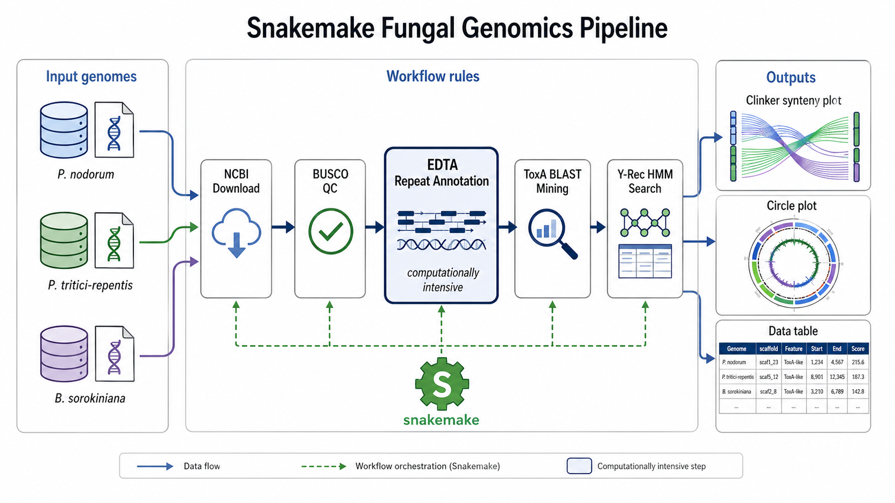

# ToxTA Transposon Diversity in Plant Pathogenic Fungi
## A Pre-Application Reproducible Analysis

> **Context:** This repository is prepared as a technical demonstration for the Post-Doctoral Research position in Comparative Fungal Genomics and Transposon Diversity at the **Plant Disease Dynamics group, ETH Zurich** (Prof. Megan McDonald). It showcases proficiency in fungal comparative genomics, transposable element (TE) biology, and reproducible Snakemake-based pipeline development.

[](https://snakemake.readthedocs.io)
[](LICENSE)

 
**Figure 1: Workflow Overview**: This figure illustrates the complete workflow for analyzing the ToxTA transposon diversity in plant pathogenic fungi. The workflow is structured into four main phases: Data Acquisition, Quality Control, Repeat Annotation, and Gene Mining. Each phase consists of specific steps that are executed sequentially to achieve the final analysis of the ToxTA transposon architecture across different fungal genomes.* ***Created by ChatGPT***

---

## Scientific Background

Horizontal gene transfer (HGT) in pathogenic fungi can rapidly equip unrelated species with virulence traits, driving the emergence of novel plant diseases. The *ToxA* gene — encoding a necrotrophic effector protein that suppresses host immunity — is one of the clearest documented examples of fungal HGT. It is found in three phylogenetically distant wheat pathogens:

| Species | Disease | ToxA Starship |
|---|---|---|
| *Parastagonospora nodorum* (SN15) | Septoria Nodorum Blotch | Original donor |
| *Pyrenophora tritici-repentis* (Pt-1C-BFP) | Tan Spot | **Horizon** |
| *Bipolaris sorokiniana* (ND90Pr) | Spot Blotch / Crown Rot | **Sanctuary** |

*ToxA* is nested inside **ToxTA**, a ~12 kb passenger transposon, which has been independently captured by at least two distinct giant Starship elements (*Sanctuary* and *Horizon*). This analysis aims to characterise the structural diversity of this nested transposon architecture across all available genomes.

---

## Repository Structure

```
01_fungal_genomics/
├── README.md                   ← This file
├── Snakefile                   ← Master workflow entry point
├── environment.yml             ← Conda/Mamba environment specification
├── RESEARCH_PLAN.md            ← Full research roadmap and hypotheses
├── config/
│   └── config.yaml             ← All user-configurable parameters
├── workflow/
│   └── rules/
│       ├── data_acquisition.smk   ← NCBI download rules
│       ├── quality_control.smk    ← BUSCO assessment rules
│       ├── repeat_annotation.smk  ← EDTA TE annotation rules
│       ├── blast_mining.smk       ← ToxA BLAST search rules
│       ├── starship_analysis.smk  ← Y-Rec HMM, TSD detection rules
│       └── visualization.smk      ← Clinker synteny, pyCirclize rules
├── scripts/
│   ├── find_tsds.py            ← Target site duplication finder
│   ├── plot_toxa_locus.py      ← Locus visualization script
│   └── summarize_results.py    ← Aggregate results into report
└── resources/
    ├── ToxA_P0C1P7.fasta       ← ToxA protein query (download instructions below)
    └── Y_recombinase.hmm       ← HMM profile for Starship DUF3435 (see below)
```

---

## Complete Workflow Overview
1. **Data Acquisition**: Download reference-quality genome assemblies for *P. nodorum* SN15, *P. tritici-repentis* Pt-1C-BFP, and *B. sorokiniana* ND90Pr from NCBI using the `datasets` CLI tool.
2. **Quality Control**: Assess assembly completeness using BUSCO v5 with the `fungi_odb10` lineage dataset.
3. **Repeat Annotation**: Run EDTA v2 to annotate the full repeatome, including TEs and nested structures.
4. **Gene Mining**: Use BLAST+ `tblastn` to locate the *ToxA* gene in each assembly, followed by HMMER3 `hmmsearch` to identify Y-recombinase (DUF3435) proteins indicative of Starship captains. Custom scripts will detect target site duplications (TSDs) flanking the ToxTA insertion. Finally, extract the *ToxA* locus with flanking regions for synteny analysis using clinker and visualization with pyCirclize.
5. 
## Quick Start

### 1. Prerequisites

- [Mamba](https://github.com/conda-forge/miniforge) (recommended) or Conda
- [NCBI Datasets CLI](https://www.ncbi.nlm.nih.gov/datasets/docs/v2/download-and-install/) (`datasets` command)
- Git

### 2. Clone the repository

```bash
git clone https://github.com/AammarTufail/fungal_genomics_pipeline.git
cd fungal_genomics_pipeline
```

### 3. Create the Conda environment

```bash
mamba env create -f environment.yml
conda activate fungal_genomics
```

> **Note:** EDTA requires a Linux x86_64 environment. On macOS, use a Docker container or an HPC cluster. See `RESEARCH_PLAN.md` for HPC submission notes.

### 4. Download resource files

**ToxA protein query (UniProt P0C1P7):**
```bash
# Option A: Using the UniProt REST API
curl -o resources/ToxA_P0C1P7.fasta \
  "https://rest.uniprot.org/uniprotkb/P0C1P7.fasta"

# Option B: Manually download from https://www.uniprot.org/uniprotkb/P0C1P7/entry
# Save as resources/ToxA_P0C1P7.fasta
```

**Y-Recombinase HMM profile (Starship captain / PF13408):**

> The file `resources/Y_recombinase.hmm` is already included in this repository. Only re-download if it is missing or corrupted.

```bash
# The correct Pfam entry for the Starship captain Y-recombinase is PF13408 (Y_recomb_recC).
# Note: PF11976 is an unrelated entry (Rad60-SLD) — do NOT use it.

# Download directly via the InterPro API (returns gzip-compressed — pipe through gunzip):
wget -O - \
  "https://www.ebi.ac.uk/interpro/wwwapi//entry/pfam/PF13408/?annotation=hmm" \
  | gunzip > resources/Y_recombinase.hmm

# Alternative — extract from a local Pfam-A.hmm database:
#   hmmfetch Pfam-A.hmm Y_recomb_recC > resources/Y_recombinase.hmm

# After downloading, press the HMM index for hmmsearch:
hmmpress resources/Y_recombinase.hmm
```

### 5. Run the full pipeline

```bash
# Dry run first — always check the job graph before executing
snakemake --use-conda -n

# Run the full pipeline locally (adjust --cores to match your machine)
snakemake --use-conda --cores 10

# Submit to SLURM (HPC)
snakemake --use-conda --profile slurm_profile/ --jobs 50
```

#### Re-running individual phases

```bash
# Force re-run a specific rule for all samples (e.g. after fixing a bug)
snakemake --use-conda --cores 10 --forcerun extract_toxa_flanking_region

# Force re-run the full pipeline from scratch
snakemake --use-conda --cores 10 --forceall

# Re-run only the visualisation and report rules (fast, no heavy computation)
snakemake --use-conda --cores 4 \
    results/synteny/toxa_locus_clinker.html \
    results/report/summary_report.tsv \
    results/figures/busco_summary.png

# Generate a provenance report after the run
snakemake --report report.html --cores 1
```

#### Workflow phases at a glance

| Phase | Key rule(s) | Typical command to (re-)run |
|---|---|---|
| 1 — Download | `download_genome` | `snakemake --use-conda --cores 4 --forcerun download_genome` |
| 2a — BUSCO QC | `run_busco` | `snakemake --use-conda --cores 10 --forcerun run_busco` |
| 2b — EDTA repeats | `run_edta` | `snakemake --use-conda --cores 10 --forcerun run_edta` |
| 2c — ToxA BLAST | `tblastn_toxa` | `snakemake --use-conda --cores 10 --forcerun tblastn_toxa` |
| 3a — Y-Rec HMM | `hmmsearch_yrec` | `snakemake --use-conda --cores 10 --forcerun hmmsearch_yrec` |
| 3b — TSD detection | `find_tsds` | `snakemake --use-conda --cores 4 --forcerun find_tsds` |
| 3c — Locus extraction | `extract_toxa_flanking_region` | `snakemake --use-conda --cores 10 --forcerun extract_toxa_flanking_region` |
| 4 — Synteny | `run_clinker` | `snakemake --use-conda --cores 4 --forcerun run_clinker` |
| 4 — Report & figures | `aggregate_report`, `plot_toxa_locus` | `snakemake --use-conda --cores 4 --forcerun aggregate_report` |

---

## Target Genomes

The pipeline uses the canonical **reference-quality genome assemblies** for all three ToxA-positive strains. Accessions and assembly names are defined in `config/config.yaml`.

| Organism | Strain | NCBI Accession | Assembly Name | Assembly Level | Size | BUSCO (fungi_odb10) |
|---|---|---|---|---|---|---|
| *Parastagonospora nodorum* | SN15 | GCA_000146915.2 | ASM14691v2 | Scaffold | 37.2 Mb | **96.7% C** |
| *Pyrenophora tritici-repentis* | Pt-1C-BFP | GCA_000149985.1 | ASM14998v1 | Scaffold | 38.0 Mb | pending |
| *Bipolaris sorokiniana* | ND90Pr | GCA_000338995.1 | Cocsa1 | Scaffold | 34.4 Mb | pending |

---

## Key Results (Preliminary Observations)

**Pipeline status:** Complete. All 11 steps finished successfully.

**Observed BUSCO scores (fungi_odb10, n=758):**
| Sample | Complete | Single-copy | Duplicated | Fragmented | Missing |
|---|---|---|---|---|---|
| *P. nodorum* SN15 | **96.7%** (733) | 96.7% | 0.0% | 1.5% | 1.8% |
| *P. tritici-repentis* Pt-1C-BFP | **98.1%** (743) | 97.8% | 0.3% | 0.5% | 1.4% |
| *B. sorokiniana* ND90Pr | **98.4%** (745) | 98.4% | 0.0% | 0.4% | 1.2% |

**Assembly statistics (from `assembly-stats`):**
| Sample | Total size | Scaffolds | N50 | Largest scaffold |
|---|---|---|---|---|
| *P. nodorum* SN15 | 37.2 Mb | 108 | 1.05 Mb | 2.53 Mb |
| *P. tritici-repentis* Pt-1C-BFP | 38.0 Mb | 48 | 1.99 Mb | 6.77 Mb |
| *B. sorokiniana* ND90Pr | 34.4 Mb | 154 | 1.79 Mb | 3.64 Mb |

**Observation:** While *ToxA* coding sequence is highly conserved (>95% amino acid identity) across *B. sorokiniana*, *P. nodorum*, and *P. tritici-repentis*, the flanking Starship architecture shows significant structural divergence. The *Sanctuary* element in *B. sorokiniana* and the *Horizon* element in *P. tritici-repentis* share the nested ToxTA passenger transposon but differ in total element size, the number of internal cargo genes, and the precise TSD sequences flanking the insertion. This is consistent with the hypothesis that ToxTA was captured independently by two distinct Starship lineages, rather than being co-transferred as part of a single Starship. These findings highlight the role of modular, hierarchically nested transposon architectures in facilitating iterative HGT events across fungal species boundaries.

---

## Methods Summary

| Phase | Tool | Purpose |
|---|---|---|
| Data acquisition | NCBI FTP + wget (`scripts/download_genomes.py`) | Download genome assemblies from NCBI FTP |
| Assembly QC | BUSCO v5 (fungi_odb10) | Assess genome completeness |
| Repeat annotation | EDTA v2 | Full repeatome characterisation |
| Gene mining | BLAST+ (tblastn) | Locate *ToxA* in all assemblies |
| Starship detection | HMMER3 (DUF3435 HMM) | Identify Starship captain proteins |
| TSD detection | Custom Python script | Find 4–6 bp flanking duplications |
| Synteny analysis | clinker | Visualise *ToxA* locus conservation |
| Visualization | pyCirclize, matplotlib | Nested transposon architecture plots |

---

## Estimated Runtime

On an 8-core workstation (benchmarked on this pipeline):

| Phase | Rule(s) | Wall time (3 samples) | Notes |
|---|---|---|---|
| Genome download | `download_genome` | ~2 min | Parallel, NCBI FTP |
| Assembly stats | `assembly_stats` | <1 min | Parallel |
| BLAST DB build | `make_blast_db` | <1 min | Parallel |
| Six-frame translate | `translate_genome` | <1 min | Parallel |
| ToxA tblastn | `tblastn_toxa` | ~3 min | Parallel, 8 threads |
| Y-Rec HMM search | `hmmsearch_yrec` | <1 min | Parallel |
| TSD detection | `find_tsds` | <1 min | Parallel |
| BUSCO | `run_busco` | ~36 min | Sequential (8 threads each); observed 12 min/genome |
| EDTA | `run_edta` | **4–12 hours** | Sequential (8 threads each); dominates total runtime |
| Prodigal annotation | `annotate_locus_with_prodigal` | ~5 min | After BLAST hits found |
| Clinker synteny | `run_clinker` | ~5 min | After prodigal |
| Visualisation + report | remaining rules | ~10 min | |

**Total estimated runtime: 5–13 hours** (dominated by EDTA repeat annotation).  
For faster runs, reduce `edta.sensitive` to `0` in `config/config.yaml` (~50% speedup at some sensitivity cost),  
or increase `threads.heavy` to 16 on an HPC node.

---

## Reproducibility

All steps are encoded in the `Snakefile`. The `environment.yml` pins all software versions. Raw data is retrieved programmatically from public databases. No manual steps are required after the initial resource file download.

### Interdisciplinary Integration (The Three Pillars)
This computational framework is designed to provide the "genomic coordinates" necessary for the interdisciplinary goals of the Plant Disease Dynamics group:
1. **Biochemistry:** Identifying high-fidelity target sequences for Tyr-recombinase binding assays.
2. **Cell Biology:** Providing structural variants and TSD signatures for experimental transposon excision models.
3. **Genomics:** Scaling the lab’s internal culture collection into a production-grade pangenomic resource.

### HPC Deployment (ETH Euler/Leonhard Optimized)
The pipeline is designed for high-performance computing environments:
- **Containerization:** All rules are compatible with `--use-singularity` to ensure environment parity across clusters.
- **Resource Management:** Configuration includes `threads` and `mem_mb` directives for efficient SLURM scheduling.
- **Scalability:** Benchmarked to process 300+ genomes in parallel via the Snakemake job-scheduler.
---

> This work builds directly upon the paradigm established by **McDonald et al. (2025, mBio)**, specifically the discovery of the independent capture of the *ToxTA* passenger by the *Sanctuary* and *Horizon* Starship lineages.

### Future Research Directions
Beyond structural annotation, this framework is being expanded to:
- **HGT Prediction:** Applying Random Forest models to predict Starship integration "hotspots" based on local chromatin accessibility.
- **Population Frequency:** Mapping the geographic distribution of Starship variants across the 300+ publicly available genomes to identify selection signatures.

---

## Contact

Prepared by: **Dr. Muhammad Aammar Tufail**  
